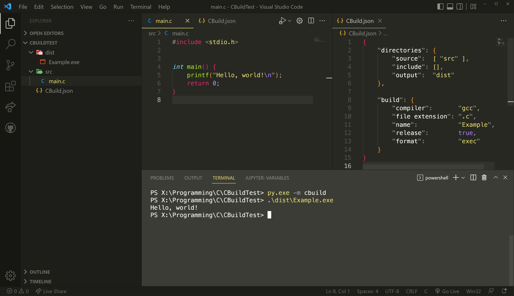

# CBuild
CBuild is a work-in-progress small and simple build system meant for smaller C Projects.

## Project Structure
CBuild is structured as a Python Package, as such, it needs to be installed via the pip package manager.

## Building CBuild
### Requirements
* Python 3.7 or newer
* The Python `build` module
* The `hatchling` backend
### Procedure
* Clone this repository
* Run the `build` module via Python (`python3 -m build` on macOS/Linux, `py -m build`  on Windows)
* Install CBuild using `pip` and the `.whl` in the `dist` directory

## Using CBuild in a C Project
* Create a file named `CBuild.json` in your project's main directory
```json
{
    "directories": {
        "source":  [ "src" ],
        "include": [ "include" ],
        "output":  "dist"
    },

    "build": {
        "compiler":       "gcc",
        "file extension": ".c",
        "name":           "Example",
        "release":        true,
        "format":         "exec"
    }
}
```
* Run CBuild via Python (`python3 -m cbuild` on macOS/Linux, `py -m cbuild` on Windows)

## Structure of `CBuild.json`
### directories
* **source:** A list of directories that contain source files
* **include:** A list of directories which should be treated as include paths
* **output:** The directory where the final binar will be stored
### build
* **compiler:** Path to a compiler binary
* **file extension:** The file extension used by source files
* **name:** The project's name (Used as name for the final binary)
* **release:** Wether the project should be built in release mode or not
* **format:** Unused for now


<div align="center">
    
</div>
